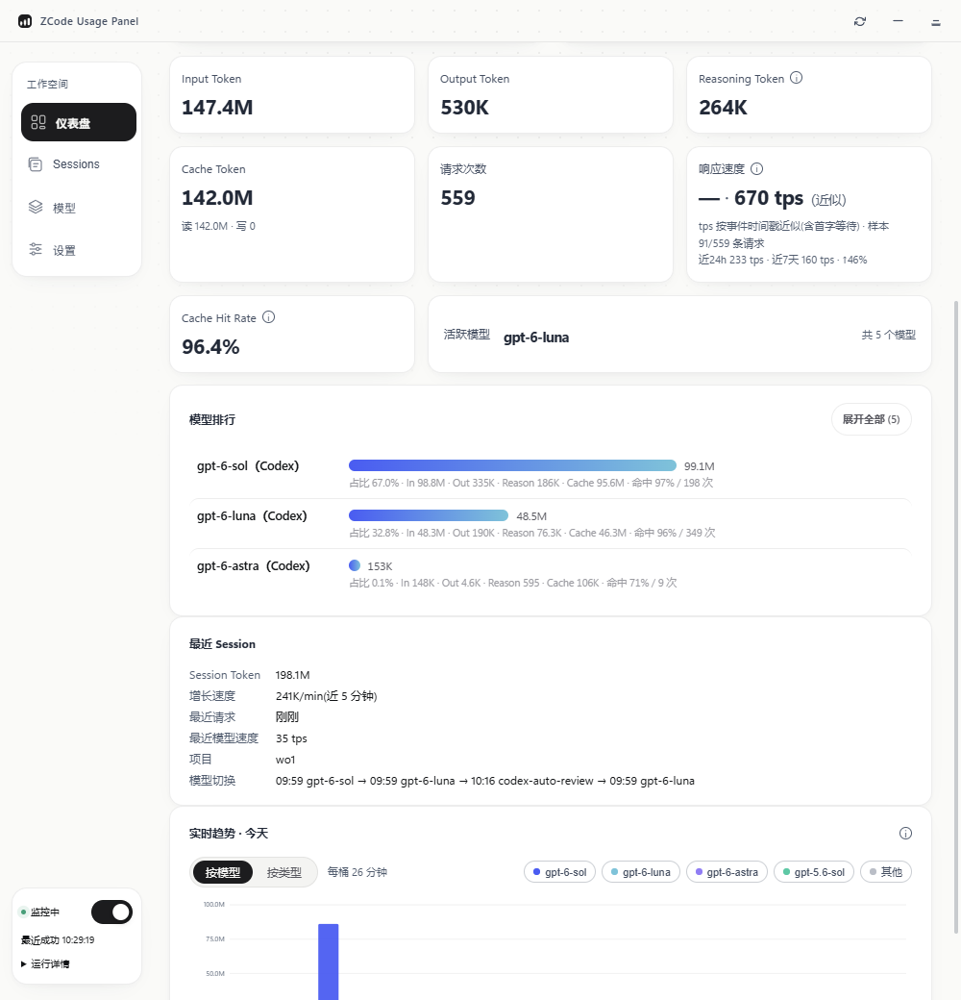

# ZCode Usage Panel

**一块面板，看尽你所有 AI 编程工具的用量。**

ZCode Usage Panel 是一个常驻 Windows 桌面的用量驾驶舱：把 ZCode、OpenAI Codex、Claude Code、DeepSeek Harness（DSH）四家的 token 消耗、响应速度、等价花费放进同一块纸感极简仪表盘。所有数据**只在你本机解析**——不上传、不统计到任何服务器。

   



---

## ✨ 它能做什么

### 📊 四源统一仪表盘

顶部 `ZCode / Codex / DSH / CC` 四个分区随手切换，每个分区都是同一套卡片密度，只是取数各自独立——**四个源的数字永远不混在一个口径里**。

| 数据源 | 说明 |
|---|---|
| **ZCode** | 总 Token、API 等价花费、Input / Output / Reasoning / Cache、Cache 命中率、请求次数、**响应速度（首 token P95 延迟 + tps，样本覆盖如实标注；另附近 24 小时 / 近 7 天固定窗口的 tps 对比行）**、活跃模型、当前 Session |
| **Codex / DSH / Claude Code** | 各自客户端本地 session 日志的完整统计，**信息密度与 ZCode 分区对齐**——总量、缓存、命中率、请求、按模型排行、实时趋势、按官方单价估算的费用，一个不少 |

今天 / 60 分钟 / 24 小时 / 7 天 / 30 天 / 全部时间范围一键切换；字段堆叠趋势图（按模型 / 按类型两种切法）+ 模型排行渐变条，模型可单独显隐；「精简视图」把卡片压成一屏。

### 🗂 多源 Sessions 浏览

四个来源的会话合并在一个列表里，前缀一眼可辨：`cx-`（Codex）、`cc-`（Claude Code）、`dsh-`（DSH）、无前缀（ZCode）。会话名、项目、模型、起止时间、Token、命中率字段齐全，长值截断 + 悬停看全；全文搜索、分页、会话内趋势详情都开箱即用。历史归档（如 Codex `archived_sessions/`、DSH zstd 压缩流）一并覆盖。

### 🧮 四源合并的模型页

模型页把四个来源的模型行并成一张表，行尾括注来源（`（ZCode）` / `（Codex）` / `（DSH）` / `（Claude Code）`）——同一个模型被两个 agent 用也不会混淆。每行给出总量、Input / Output / Reasoning / Cache、命中率与请求数、按官方单价的估算花费、响应速度；点开是单模型详情：今天 / 7 天 / 30 天 / 全量、30 天趋势、Top 10 会话分布，且按来源取数，不会串口径。

### 💰 花费估算

内置 12 家厂商、40 个模型的官方单价（编译进二进制，来源与日期可查）：Z.ai / BigModel、DeepSeek、Anthropic、OpenAI、xAI、Moonshot / Kimi、Google Gemini、MiniMax、ByteDance 火山方舟、StepFun 阶跃星辰、阿里云百炼、小米 MiMo。支持模型级手动覆盖、远程价格表、促销价到期自动回落；DeepSeek 按北京时间峰谷分时计价；USD→CNY 每日自动刷新（失败回落到内置汇率）。所有金额都明确标注「按官方 API 单价估算 · 非实际 Billing」，价格未知的模型如实显示「价格未知」。

### 📤 数据导出

设置 → 高级里一键导出，走系统保存对话框、位置由你定：时间范围统计（CSV / JSON）、模型统计（CSV）、Sessions（CSV）、原始记录（JSON）。

### 🖥 桌面体验

- **QQ 式贴边吸附**：窗口拖到屏幕边缘自动收起，只留 4px 触发条，光标一碰即滑出；多显示器 / 任务栏四边 / 100–200% DPI 全适配；
- **系统托盘**：关窗最小化到托盘，左键弹出快览 Popup，右键十项菜单直达常用功能；
- **智能挂起**：窗口全部隐藏时自动暂停监控轮询，重新打开瞬间恢复——**空闲近零开销**；
- **纸感极简视觉**：纸白底 + 细线 + 点阵背景 + 黑白药丸控件 + 克制的蓝色强调，浅色 / 深色 / 跟随系统三态；
- **ZCode 一键启动**：多路径自动检测，未运行一键拉起，已运行聚焦原窗口；
- 单实例、窗口位置记忆、数据源异常提示（读不到某个源时工具栏直接标出，悬停看原因）。

### 🧾 诚实的统计口径

不编造，是这个项目的底线：

- 总 Token 按各数据源 schema 逐条判定：input 已含缓存的**不重复加**，reasoning 嵌在 output 里的**不重复计**；
- 数据源没提供的字段显示 `unavailable` 或 `—`，绝不推算；
- 可选字段带覆盖标注（如「样本 138/199 条请求」），速度指标如实标注样本数；
- 解析、聚合全部本地实现；唯一联网的是每日汇率刷新与可选的远程价格表，都不涉及你的用量数据。

## 📦 安装

从 [Releases](https://github.com/Cee-Ovo/zcode-usage-panel/releases) 下载最新版：

- **`ZCode-Usage-Panel-Setup-<版本>.exe`** — NSIS 安装包，双击安装（per-user 无需管理员），带开始菜单与可选桌面快捷方式，可正常卸载；
- **`ZCode-Usage-Panel-Portable-<版本>.zip`** — 便携版，解压即用。

要求：Windows 10+（WebView2，Win11 自带）。

## 🚀 快速上手

1. 安装后启动，面板会**自动发现**本机的 ZCode / Codex / Claude Code / DSH 数据目录（也支持 `ZCODE_HOME`、`CODEX_HOME`、`DSH_HOME`、`CLAUDE_CONFIG_DIR` 环境变量或在设置里手动指定）；
2. 首次使用建议核对一次「今天」总 Token 与各客户端自带 Usage 页数字；
3. 想看别的源，点顶部分区切到 Codex / DSH / CC；想核对单价，去设置 → API 价格表。

## 🛠 本机构建

```powershell
git clone https://github.com/Cee-Ovo/zcode-usage-panel.git
cd zcode-usage-panel
npm install
npm run tauri dev    # 开发调试
npm run tauri build  # 产出 src-tauri/target/release/bundle/nsis/*.exe
```

要求：Node ≥ 18、Rust stable（`x86_64-pc-windows-msvc`）、WebView2。推送 `v*` 标签会触发 GitHub Actions 自动构建安装包并挂到 Releases。

## 🧪 开发与测试

```powershell
npx vitest run                                   # 前端:格式化/口径/store/多源 mock
cargo test --manifest-path src-tauri/Cargo.toml  # 数据层:JSONL 增量/半行/截断容错、
                                                  # SQLite 发现/水位/busy、四源聚合口径、
                                                  # 价格解析与峰谷分时、汇率回落
```

UI 可在无 Tauri 环境下用 `npm run dev`（DEV mock 数据，四源齐备）开发调试；Windows 专属行为（吸附 / 托盘 Popup）在非 Windows 平台编译为空实现，数据层可跨平台开发。

`scripts/app-shot-readme.cjs` 是 README 截图的生成脚本：给运行中的应用开 WebView2 远程调试口后，它会连上真机截取仪表盘，保证文档里的图与生产构建一致。

## 📐 已知限制

- 等价花费为估算值，与任何实际 Billing 无关（内置价格表可远程更新 / 手动覆盖）；
- SQLite 表无 rowid 且无整数主键时退化全扫 + 行哈希去重（上限 50 万行）；
- 源数据**文件**被删除时其记录会立即从统计中移除；但数据库内部只删掉部分行（表内清理/裁剪）时不会反映，需重启进程重建；
- 切换「ZCode 数据目录」会清空并重建全部统计（旧目录的记录不会残留，也不会与新目录重复计入）。

## License

MIT（见 [LICENSE](LICENSE)，第三方许可见 `THIRD-PARTY-NOTICES.md`）。